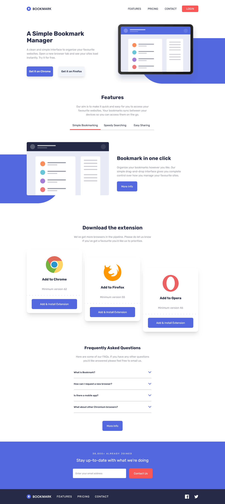

# Frontend Mentor - Bookmark landing page solution

This is a solution to the [Bookmark landing page challenge on Frontend Mentor](https://www.frontendmentor.io/challenges/bookmark-landing-page-5d0b588a9edda32581d29158). Frontend Mentor challenges help you improve your coding skills by building realistic projects.

## Table of contents

- [Overview](#overview)
  - [Screenshot](#screenshot)
  - [Links](#links)
- [My process](#my-process)
  - [Built with](#built-with)
  - [What I learned](#what-i-learned)
- [Author](#author)

## Overview

### The challenge

Users should be able to:

- View the optimal layout for the site depending on their device's screen size
- See hover states for all interactive elements on the page
- Receive an error message when the newsletter form is submitted if:
  - The input field is empty
  - The email address is not formatted correctly

### Screenshot



### Links

- Live Site URL: [https://alfizain.github.io/bookmark-landing-page/](https://alfizain.github.io/bookmark-landing-page/)

## My process

### Built with

- Semantic HTML5 markup
- Flexbox
- CSS Grid
- Mobile-first workflow
- Tailwind CSS 4

### What I learned

Tailwindcss 4 theme

```css
@theme {
  --font-rubik: "Rubik", sans-serif;

  --color-soft-blue: hsl(231, 69%, 60%);
  --color-soft-red: hsl(0, 94%, 66%);

  --color-grayish-blue: hsl(229, 8%, 60%);
  --color-very-dark-blue: hsl(229, 31%, 21%);
}
```

Tailwindcss 4 data attribute

```html
<button
  id="simple-bookmark-button"
  aria-controls="simple-bookmark-content"
  aria-expanded="true"
  data-tab-active="true"
  class="tab-button relative p-4 cursor-pointer transition duration-300 hover:text-soft-red after:transition after:duration-300 after:block after:absolute after:bottom-0 after:left-1/2 after:-translate-x-1/2 after:w-3/4 after:h-1 after:bg-soft-red data-[tab-active=true]:after:scale-100 data-[tab-active=false]:after:scale-0 md:after:w-full">
  Simple Bookmarking
</button>
```

Accordion without js, only html and tailwindcss class

```html
<details class="group border-b border-y-grayish-blue">
  <summary class="flex items-center justify-between w-full py-6 text-very-dark-blue font-medium cursor-pointer transition duration-300 hover:text-soft-red">
    What is Bookmark?
    <span class="text-soft-blue transition duration-300 group-open:text-soft-red group-open:rotate-180">
      <svg xmlns="http://www.w3.org/2000/svg" width="18" height="12"><path fill="none" stroke="currentColor" stroke-width="3" d="M1 1l8 8 8-8" /></svg>
    </span>
  </summary>
  <p class="mt-2 mb-8">Lorem ipsum dolor sit amet, consectetur adipiscing elit. Fusce tincidunt justo eget ultricies fringilla. Phasellus blandit ipsum quis quam ornare mattis.</p>
</details>
```

## Author

- Website - [Muhammad Alfi Zain](https://alfizain.github.io/AlfiZain/)
- Frontend Mentor - [@AlfiZain](https://www.frontendmentor.io/profile/AlfiZain)
